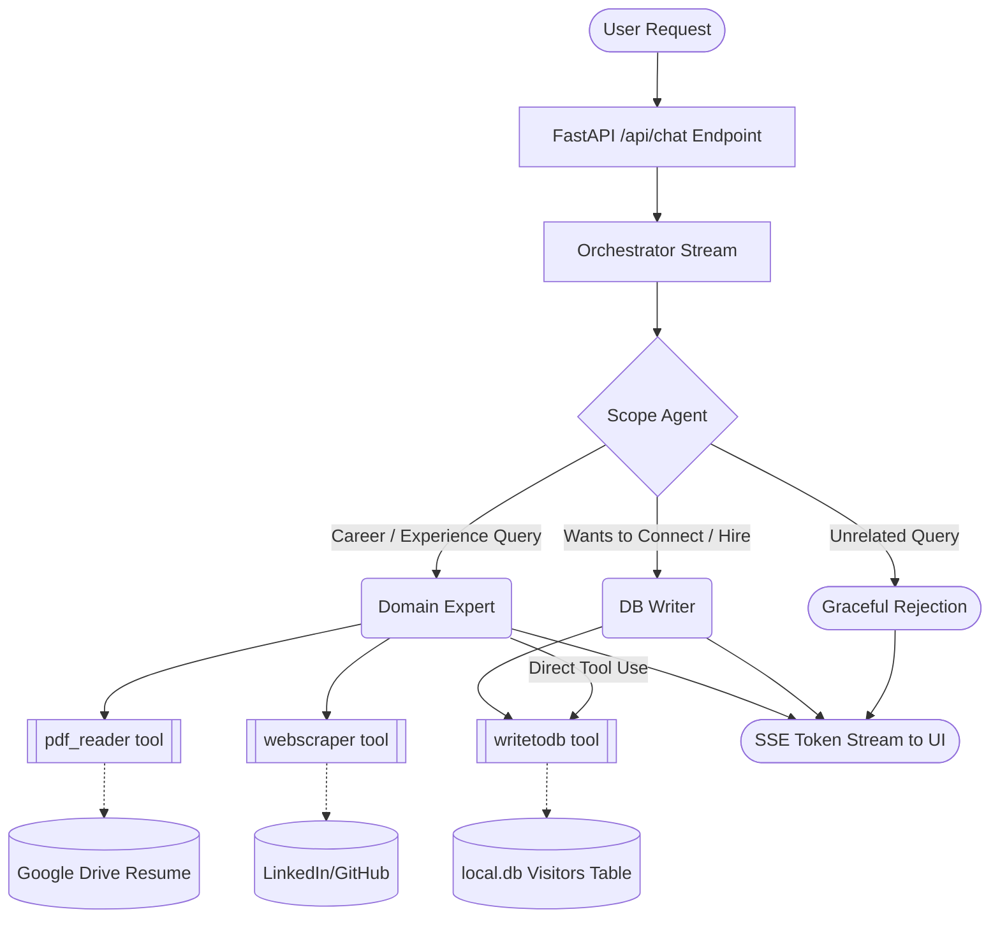

# Personal Bot Backend (Digital Twin)


🔗 **[Live Demo (chat widget)](https://profile-64ef8.firebaseapp.com/)** · **[Portfolio](https://profile-64ef8.firebaseapp.com/)** · **[LinkedIn](https://www.linkedin.com/in/ramveer7up/)**

This is a FastAPI-based backend that powers the **Digital Twin AI Assistant** for Ramveer Singh's personal portfolio. 

Built using the [OpenAI Agents SDK](https://github.com/openai/openai-python), this project utilizes a **Multi-Agent Orchestration Architecture** to intelligently route queries, read external documents (like Resumes and GitHub profiles), and securely save contact information into a local SQLite database—all while fully supporting real-time Server-Sent Events (SSE) streaming!

## Architecture


The backend utilizes three specialized AI agents working in tandem:

1. **Scope Agent (The Router)**
   - Acts as the first line of defense.
   - Evaluates if the user's query is relevant to Ramveer's professional life, education, or skills.
   - Rejects completely unrelated queries (e.g., cooking recipes).
   - Seamlessly hands off relevant queries to the Domain Expert or DB Writer.

2. **Domain Expert**
   - The core knowledge base representing Ramveer.
   - Has access to specialized Python tools:
     - `pdf_reader`: Dynamically scrapes and reads Ramveer's Resume from Google Drive.
     - `webscraper`: Capable of pulling text from web links like LinkedIn or GitHub.
   - Can dynamically answer questions based purely on the factual data retrieved from these tools, preventing hallucinations.

3. **DB Writer**
   - Triggers when a user wants to connect, collaborate, or hire Ramveer.
   - Asks for the user's email address and invokes the `writetodb` tool.
   - Saves the contact email into the local SQLite `visitors` table (`local.db`) so Ramveer can reach out later.

## Key Features

- **Real-Time Streaming**: Uses an asynchronous Python generator (`Runner.run_streamed`) to pipe OpenAI tokens directly to the frontend as they generate.
- **Mid-Stream Handoffs**: Custom orchestrator logic gracefully intercepts agent-to-agent transfers mid-stream without breaking the HTTP connection.
- **FastAPI Endpoint**: Exposes a clean `POST /api/chat` endpoint compatible with Vercel AI SDK and custom React hooks.
- **SQLite Lead Capture**: Safely stores visitor emails locally.

## Getting Started

### Prerequisites
- Python 3.12+
- `pip` / `venv`
- OpenAI API Key

### Installation

1. Clone the repository and navigate to the project directory.
2. Create and activate a virtual environment in the `backend` folder:
   ```bash
   cd backend
   python -m venv venv
   source venv/bin/activate
   ```
3. Install the dependencies:
   ```bash
   pip install -r requirements.txt
   ```
4. Create a `.env` file in the `backend/` directory (see `.env.example` if applicable) and configure your keys:
   ```env
   OPENAI_API_KEY=sk-...
   LIBSQL_URL="file:./local.db"
   USER_NAME="Ramveer Singh"
   ALLOWED_SCRAPE_DOMAINS='{"resume": "https://drive.google.com/...", "github": "..."}'
   ```

### Running the Server

Use the provided bash script to start the Uvicorn server:
```bash
sh start.sh
```
The API will be available at `http://0.0.0.0:8000`.

### API Usage
Send a POST request to `/api/chat`:
```bash
curl -X POST http://localhost:8000/api/chat \
  -H "Content-Type: application/json" \
  -d '{"messages": [{"role": "user", "content": "Tell me about Ramveer"}]}' \
  --no-buffer
```

## Database Management
The local SQLite database will be automatically created in the root of your project as `local.db`. 
To view captured emails, run:
```bash
sqlite3 local.db "SELECT * FROM visitors;"
```

---

<p align="center">
  Built by <a href="https://profile-64ef8.firebaseapp.com/">Ramveer Singh</a> · 
  <a href="https://www.linkedin.com/in/ramveer7up/">LinkedIn</a> · 
  <a href="https://github.com/ramveer93">GitHub</a>
</p>
